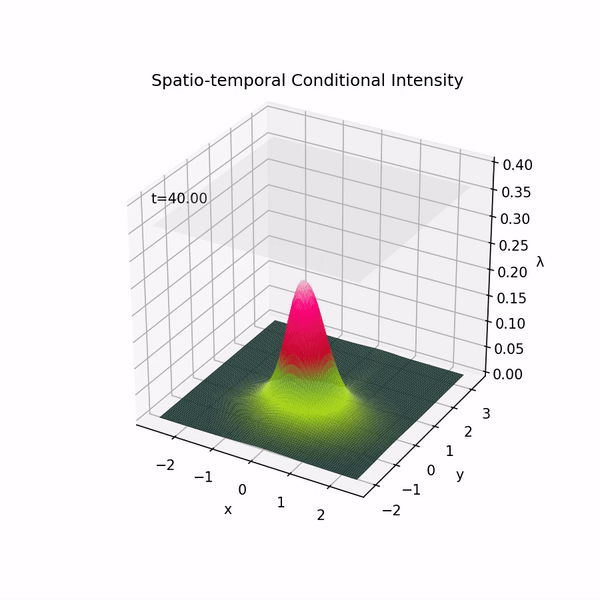

# Deep Spatiotemporal Point Process [[Paper](https://proceedings.mlr.press/v168/zhou22a/zhou22a.pdf)]

**Zihao Zhou, Adam Yang, Ryan Rossi, Handong Zhao, Rose Yu**

To Appear in *Annual Conference on Learning for Dynamics and Control* (L4DC), 2022

*Abstract.* Learning the dynamics of spatiotemporal events is a fundamental problem. Neural point processes enhance the expressivity of point process models with deep neural networks. However, most existing methods only consider temporal dynamics without spatial modeling. We propose Deep Spatiotemporal Point Process (DeepSTPP), a deep dynamics model that integrates spatiotemporal point processes. Our method is flexible, efficient, and can accurately forecast irregularly sampled events over space and time. The key construction of our approach is the nonparametric space-time intensity function, governed by a latent process. The intensity function enjoys closed-form integration for the density. The latent process captures the uncertainty of the event sequence. We use amortized variational inference to infer the latent process with deep networks. Using synthetic datasets, we validate our model can accurately learn the true intensity function. On real-world benchmark datasets, our model demonstrates superior performance over state-of-the-art baselines.

